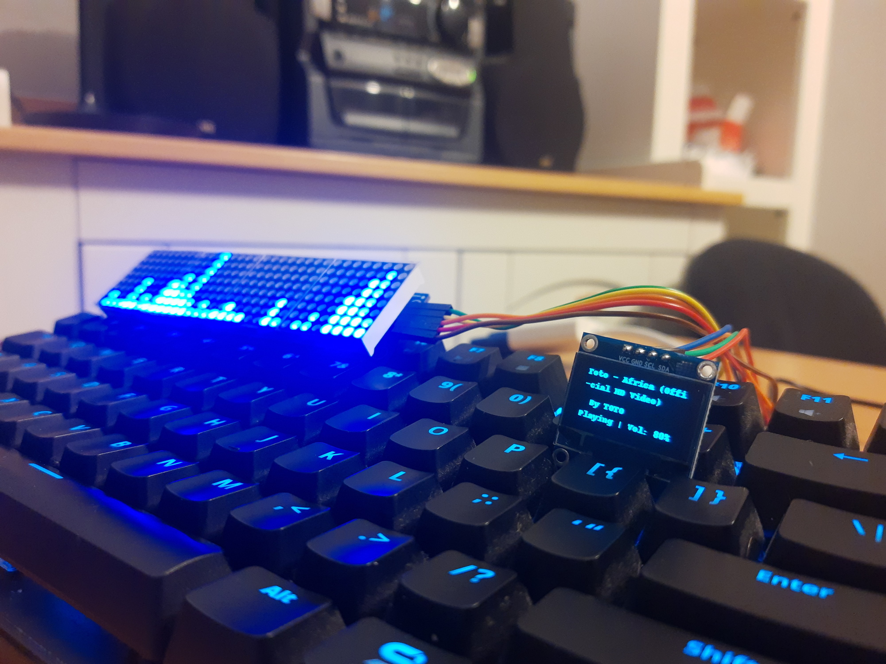

# Audio Visualizer

## About
Simple audio visualizer based on Raspberry PI, which can be connected to PC via bluetooth and stream music from YouTube.

Video presentation of working device:

## Build Setup
- Hardware:
  - Raspberry Pi 3 (or other Raspberry PI with bluetooth module)
  - Led Matrix 32x8 + MAX7219
  - Oled display + SH1106

- Software:
  - Raspberry Pi OS
  - Python 3 and third-party packages:
    - [numpy](http://www.numpy.org)
    - [scipy](https://www.scipy.org)
    - [luma.oled](https://luma-oled.readthedocs.io/en/latest/)
    - [luma.led_matrix](https://luma-led-matrix.readthedocs.io/en/latest/)
    - [pybluez](https://pybluez.readthedocs.io/en/latest/)
    - [pyaudio](https://people.csail.mit.edu/hubert/pyaudio/)
    - [python-vlc](https://wiki.videolan.org/Python_bindings/)
    - [youtube-search-python](https://pypi.org/project/youtube-search-python/)
    - [pafy](https://pypi.org/project/pafy/)
  - ALSA

## Wiring

1. MAX7219 (LED matrix)

| LED pin | OPi pin (phys) | OPi pin name |
| ------- | -------------- | ------------ |
| VCC     | pin 4          | +5V          |
| GND     | pin 14         | GND          |
| DIN     | pin 19         | SPI0_MOSI    |
| CS      | pin 24         | SPI0_CS0     |
| CLK     | pin 23         | SPI0_CLK     |

2. SH1106 (OLED display)

| DAC pin | OPi pin (phys) | OPi pin name |
| ------- | -------------- | ------------ |
| GND     | pin 6         | GND     |
| VCC    | pin 1         | +3V    |
| SCL    | pin 5         | SCL   |
| SDA     | pin 3         | SDA          |

## Configuration
1. I recommend you to read this to avoid problems with audio configuration on your Raspberry:
https://github.com/maximtrp/spectrumLED#configuration
2. Enable SPI and PCM devices in Raspberry Pi OS.
3. Install required python packages.
4. Remember to change bluetooth addres to your own in Bluetooth_Client/config.py.
## How to run
- Client (PC):
  - install all required packages
  - insert bluetooth address of your raspberry device in Bluetooth_Client/config.py
  - run Bluetooth_Client/main.py

- Server (Raspberry):
  - install all required packages
  - run Bluetooth_Server/main.py

## Credits
Audio processing function (Bluetooth_Server/led_matrix.py) is not mine and was entirely written by:
https://github.com/maximtrp/spectrumLED
